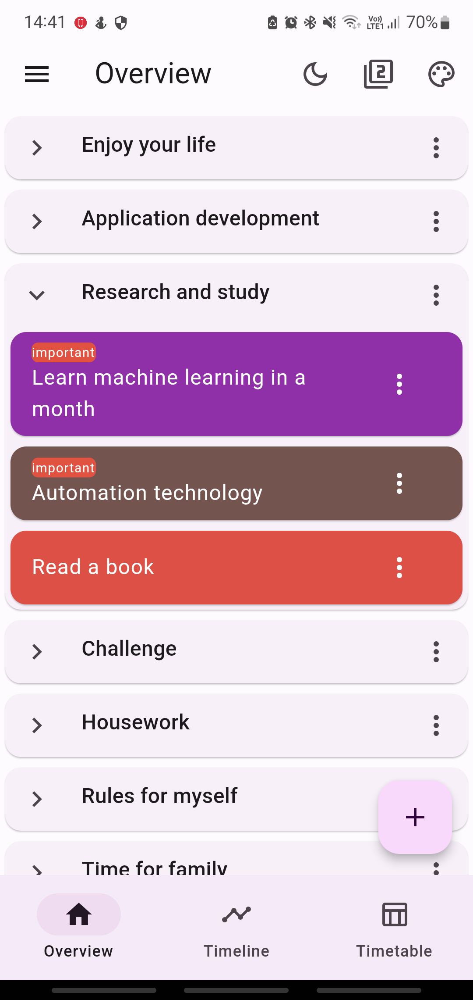
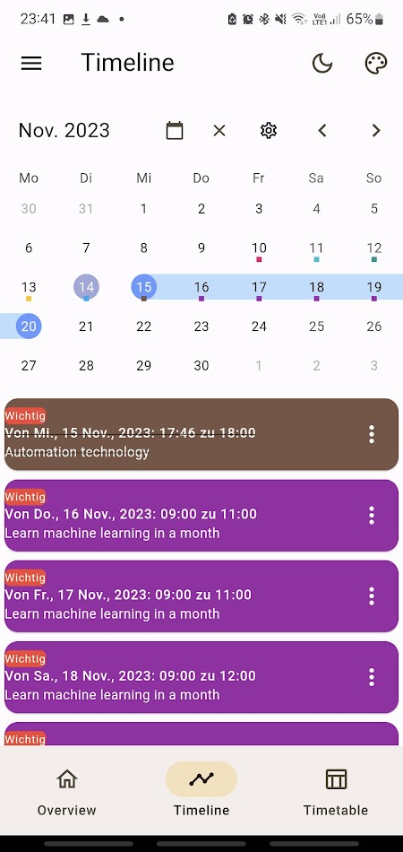
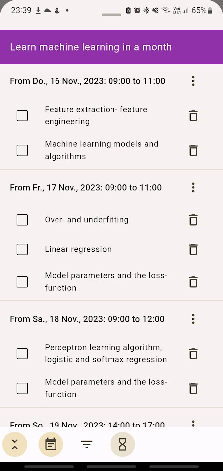
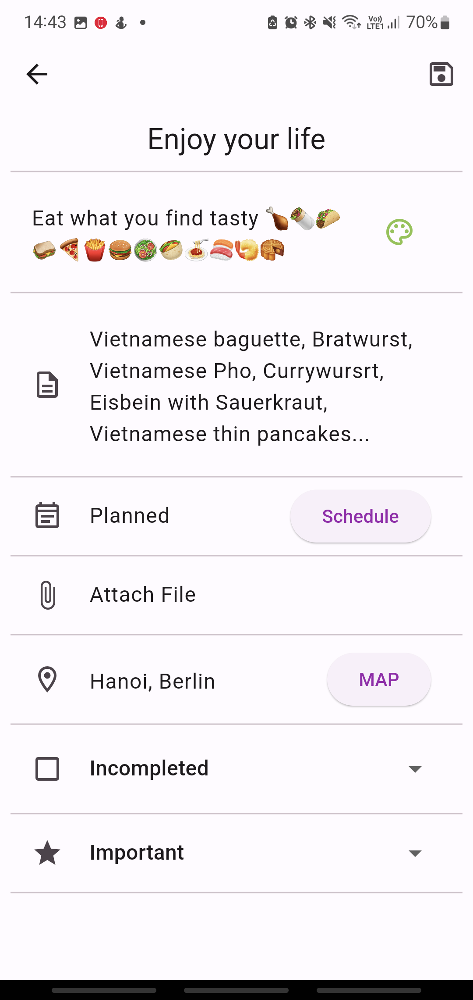
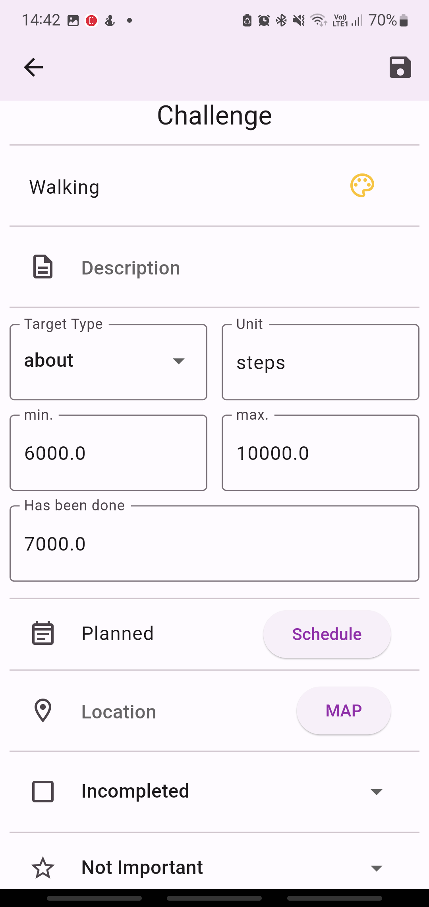
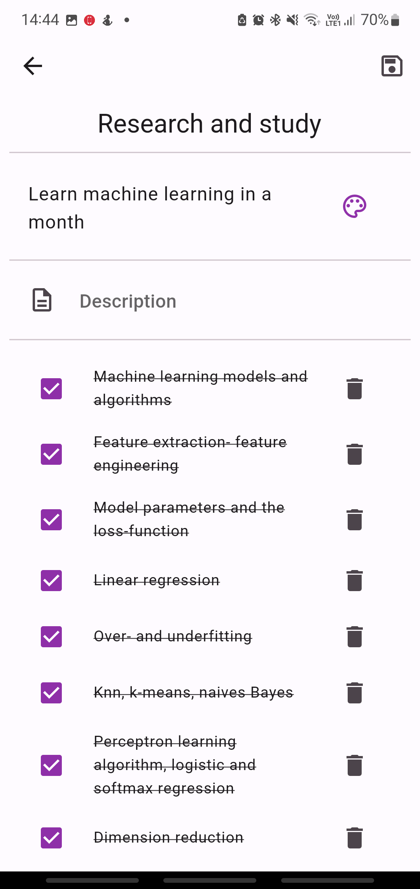

# My Time Manager

We are aiming to create the simplest yet most detailed app to manage your time for all your activities in life. You can use this app as a to-do list, calendar, habit tracker, pomodoro timer for focus mode, and you can review statistics that reflect your efforts at any given time. 

This app is continuously being developed and refined. In the future, the app will be available on multiple platforms such as iOS, MacOS, Windows, Linux... and you will be able to sync data across all platforms.

**Free Version**

**Paid Version**

**THE DIFFERENCE COMPARED TO THOUSANDS OF OTHER TIME MANAGEMENT APPLICATIONS?**

Ứng dụng này có thể giúp bạn lập, theo dõi, chỉnh sửa mọi chi tiết trong các kế hoạch dài hạn hoặc các hoạt động thường ngày của bạn theo một cách linh hoạt và tự nhiên.

Ví dụ, trong việc học tập của bạn, bạn cần đọc một cuốn sách trong một khoảng thời gian.

Ngày thứ nhất:

Thời gian: 9-11h. Đọc chương 1,2. Địa điểm: thư viện trường. Ghi chú: nhớ mang theo thẻ sinh viên để mượn sách tại thư viện

Thời gian: 15-17h. Đọc chương 3. Địa điểm: Quán cafe gần nhà.

Thời gian: 20-21h. Đọc tiếp chương 3. Địa điểm: Tại nhà.

Ngày thứ 2:

Thời gian: 8-10h. Đọc chương 4. Địa điểm: Tại nhà.

Ngày thứ 3:...

Bạn có thể lập một danh sách với tên gọi 'Research and Study' và thêm vào một nhiệm vụ 'Read a book' với các chi tiết như ở trên. Khi bạn muốn theo dõi hoặc thay đổi lại kế hoạch cho nhiệm vụ 'Read a book', bạn chỉ cần nhấn vào item của nhiệm vụ 'Read a book' và xem lại mọi chi tiết của nhiệm vụ này. Bạn cũng có thể xem lại các khung thời gian của nhiệm vụ này trên các màn hình lịch ngày, lịch tuần hoặc lịch tháng.

Một ví dụ khác cho việc theo dõi các hoạt động thường ngày của bạn. Bạn muốn lên kế hoạch cho bài tập Squat như bên dưới:

Monday: 

Thời gian: 18h- 19h. Mục tiêu: ít nhất 100 lần. Địa điểm: phòng tập gym. Ghi chú: đừng quên mang theo chai nước!

Wednesday: 

Thời gian: 12-13h. Mục tiêu: ít nhất 50 lần. Địa điểm: tại nhà.

Friday: 

Thời gian: 18h- unknow endtime. Mục tiêu: ít nhất 100 lần. Địa điểm: tại nhà.

Sunday: ...

Bạn có thể lập một danh sách mang tên 'Workout' và thêm vào một nhiệm vụ định lượng với tiêu đề 'Squat' và thêm vào mọi chi tiết ở kế hoạch bên trên.

**Application view**

    <table>
        <tr>
            <td style="text-align: center">
                
            </td>            
            <td style="text-align: center">
                
            </td>
            <td style="text-align: center">
                
            </td>
        </tr>
        <tr>
            <td style="text-align: center">
                
            </td>
            <td style="text-align: center">
                
            </td>
            <td style="text-align: center">
                
            </td>
        </tr>
    </table>

**See video**

### Still To Do:
This project is continuously being refined. Some interface elements and functions similar to those of Google Calendar, Samsung Calendar, Microsoft To Do, etc., will gradually be added and continuously improved in the future.

* ~~Add measurable tasks and tasks with subtasks models.~~
* ~~Add the function to switch between light and dark mode.~~
* ~~Add the function to select colors for the theme.~~
* ~~Add the function to switch the interface between Material Design 2 and 3.~~
* ~~Add the function to select language.~~
* Add file attachment feature for tasks and events.
* Add alarm feature for tasks and events.
* Add account creation feature and sync data with Firebase.
* Add offline data backup feature.
* Add focus timer and concentration music feature. Create statistical graphs of focused time periods by day, week, month, year.
* Add day, week, month, year views for the calendar. Add a function that allows adding new tasks and events or planning for pre-created tasks and events by clicking on the time slots in the calendar.
* Create widgets to display on the home screen and lock screen.
* Modify widgets for large screen types of tablets, windows, macos.

