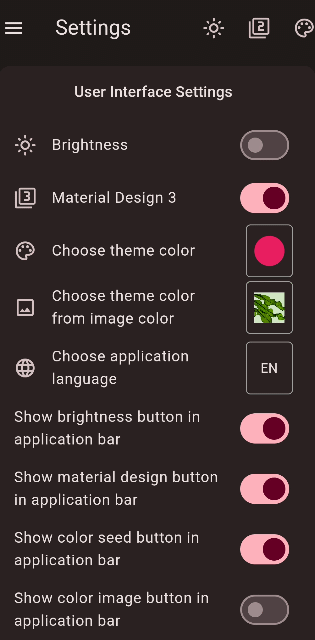

# My Time Manager

We are aiming to create the simplest yet most detailed app to manage your time for all your activities in life. You can use this app as a to-do list, calendar, habit tracker, pomodoro timer for focus mode, and you can review statistics that reflect your efforts at any given time. 

Ứng dụng được thiết kế theo hướng trực quan, dễ dàng sử dụng...

This app is continuously being developed and refined. In the future, the app will be available on multiple platforms such as iOS, MacOS, Windows, Linux... and you will be able to sync data across all platforms.

## MAIN FUNCTIONS

* Tạo các danh sách nhiệm vụ và sự kiện. Các nhiệm vụ và sự kiện có thể được phân loại theo chủ đề mà người dùng mong muốn (work, study, work out, free time...)
* 
## How to use?

*Free Version

*Paid Version

### 1. Create a list, edit and delete the list. Reorder all the list items
### 2. Add a new event or new task to the list
#### 2.1 Add a new event
#### 2.2 Add a new task
#### 2.3 Add a new measurable task
#### 2.4 Add a new task with sub tasks
#### 2.5 Reorder all the items in the list
### 3. Schedule an event or a task
### 4. Settings

Dark/Light mode switch

    <table>
        <tr>
            <td style="text-align: center">
                
            </td>            
            <td style="text-align: center">
                
            </td>
            <td style="text-align: center">
                
            </td>
        </tr>
        <tr>
            <td style="text-align: center">
                
            </td>
            <td style="text-align: center">
                
            </td>
            <td style="text-align: center">
                
            </td>
        </tr>
        <tr>
            <td style="text-align: center">
                <a> 
Đây là văn bản của bạn 
 
                </a>
            </td>
            <td style="text-align: center">
                
            </td>
            <td style="text-align: center">
                
            </td>
        </tr>
    </table>

<video width="320" height="240" controls>
  <source src="https://www.youtube.com/watch?v=Xw1Hwws9VGg&ab_channel=TacazTV" type="video/mp4">
</video>

### Still To Do:
This project is continuously being refined. Some interface elements and functions similar to those of Google Calendar, Samsung Calendar, Microsoft To Do, etc., will gradually be added and continuously improved in the future.

* ~~Add measurable tasks and tasks with subtasks models.~~
* ~~Add the function to switch between light and dark mode.~~
* ~~Add the function to select colors for the theme.~~
* ~~Add the function to switch the interface between Material Design 2 and 3.~~
* ~~Add the function to select language.~~
* Add file attachment feature for tasks and events.
* Add alarm feature for tasks and events.
* Add account creation feature and sync data with Firebase.
* Add offline data backup feature.
* Add focus timer and concentration music feature. Create statistical graphs of focused time periods by day, week, month, year.
* Add day, week, month, year views for the calendar. Add a function that allows adding new tasks and events or planning for pre-created tasks and events by clicking on the time slots in the calendar.
* Create widgets to display on the home screen and lock screen.
* Modify widgets for large screen types of tablets, windows, macos.

